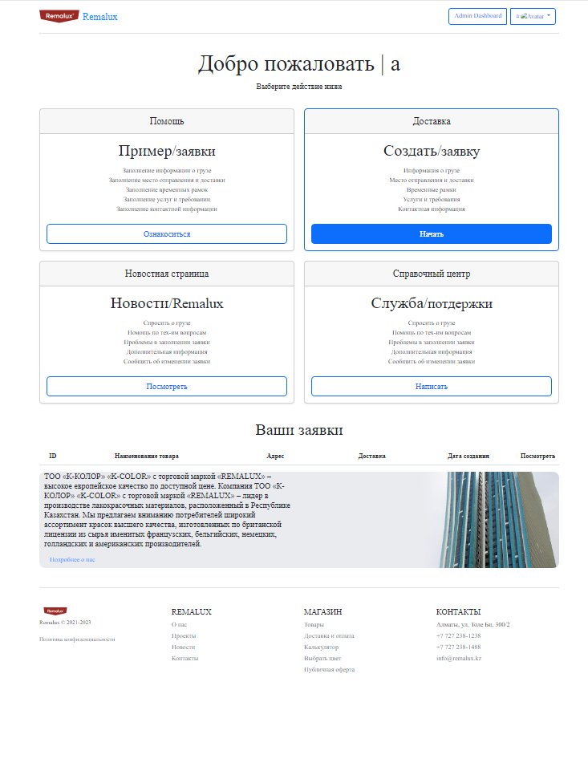
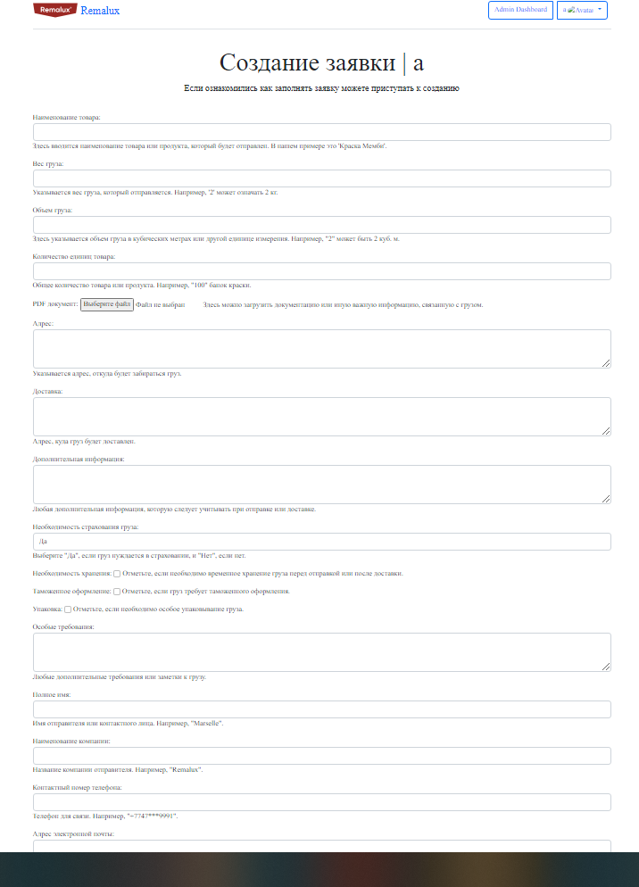
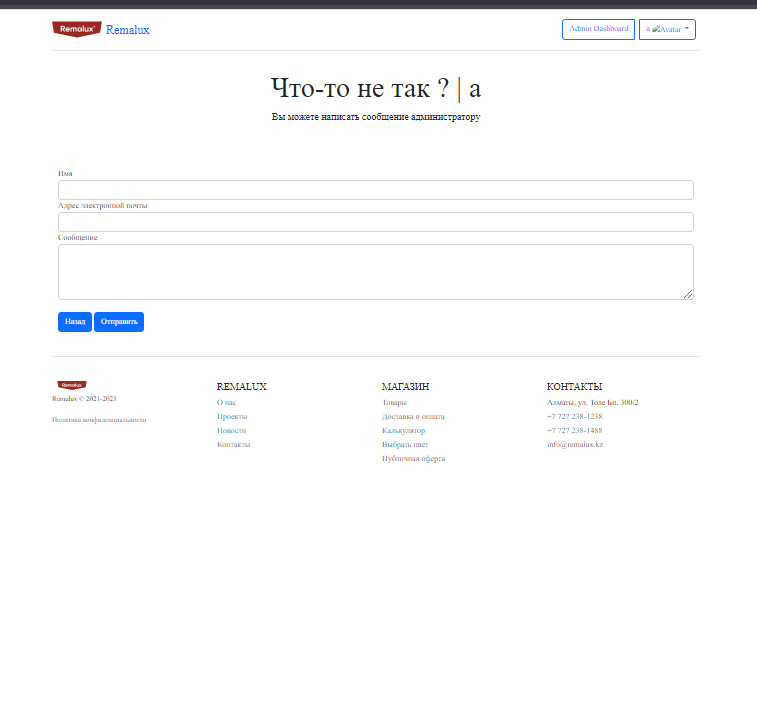

# Оптимизация процесса получения заявок на доставку: улучшение эффективности и скорости обработки заявок





## Описание проекта

Данное веб-приложение разработано для удобного и эффективного приема заявок на доставку и обеспечения оптимизации процесса обработки этих заявок. Включает в себя функционал навигационной панели, приветственного сообщения, карточек действий, таблицы с историей заявок и футера с контактной информацией.

## Особенности

- **Навигационная панель**: В верхней части страницы находится навигационная панель с логотипом компании, ссылками и элементами для авторизованных и неавторизованных пользователей.

- **Приветственное сообщение**: Отображается персонализированное приветственное сообщение для пользователя с его именем.

- **Карточки действий**: Три карточки предоставляют различные действия и информацию, которые пользователь может выбрать. Они включают в себя информацию о помощи, справочный центр и создание новой заявки на доставку.

- **Таблица с заявками**: Под карточками расположена таблица, отображающая историю заявок пользователя. Данные берутся из delivery_history, передаваемого в контексте шаблона.

- **Футер (Подвал)**: Содержит ссылки и контактную информацию компании.

## Технологии

- Django: Фреймворк для разработки веб-приложений на языке Python.
- HTML/CSS: Для верстки и стилей интерфейса.
- JavaScript: Для добавления интерактивности и динамических элементов.

## Установка и запуск

1. Клонируйте репозиторий:

    ```
    git clone https://github.com/yourusername/yourproject.git
    ```

2. Установите зависимости:

    ```
    pip install -r requirements.txt
    ```

3. Запустите локальный сервер:

    ```
    python manage.py runserver
    ```

4. Откройте веб-браузер и перейдите по адресу [http://localhost:8000/](http://localhost:8000/).

## Скриншоты





